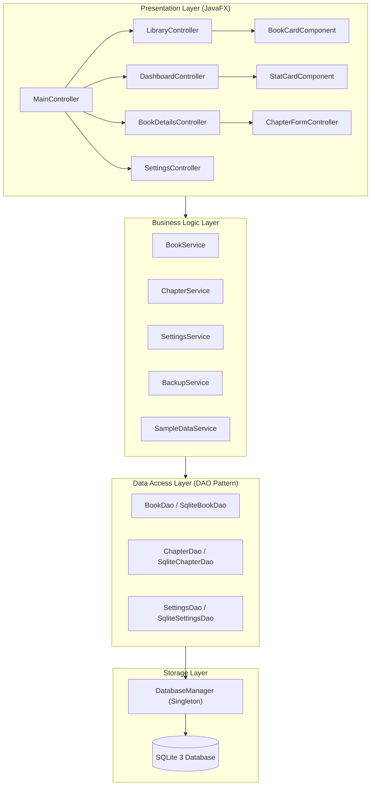

# 📚 LibraryManager

### Modern Personal Library & Reading Management Desktop Application
**Java 21** • **JavaFX 21** • **SQLite 3** • **Maven** • **GitHub Actions CI/CD** • **jpackage Native**

[](https://github.com/LordJalalMahmoud/LibraryManagerGUI/actions/workflows/ci.yml)
[](https://github.com/LordJalalMahmoud/LibraryManagerGUI/releases)
[](https://openjdk.org/projects/jdk/21/)
[](https://openjfx.io/)
[](https://www.sqlite.org/)
[-brightgreen.svg)]()
[]()

> A commercial-grade, cross-platform personal library and reading management system engineered with strict **N-Tier layered architecture (SOLID)**, **automated CI/CD pipelines**, **native self-contained OS packaging**, and **full Arabic (RTL) & English localization**.

<p align="center">
  
</p>

| ⚡ **Zero-Dependency Native Installers** | 🧪 **100% Automated Test Pass Rate (23 Tests)** | 🌍 **Full Arabic & English RTL Support** | 🎓 **University Curriculum Chapter Tracker** |
| :---: | :---: | :---: | :---: |

---

## ⚡ Quick Navigation
- [📦 Downloads & Native Installers](#-downloads--native-installers)
- [✨ Key Features](#-key-features)
- [🏛️ Software Architecture & Design Patterns](#-software-architecture--design-patterns)
- [🧪 Automated Testing Suite](#-automated-testing-suite)
- [⚙️ CI/CD & Native Packaging (DevOps)](#-cicd--native-packaging-devops)
- [🚀 Developer Quick Start](#-developer-quick-start)
- [📂 Codebase Structure](#-codebase-structure)

---

## 📦 Downloads & Native Installers

Production-ready, standalone native installers built automatically via GitHub Actions with a **bundled, minimal Java Runtime Environment (JRE)**. **End-users do not need Java installed on their machine.**

👉 **[Download the Latest Release (v1.0.0)](https://github.com/LordJalalMahmoud/LibraryManagerGUI/releases/latest)**

| OS / Platform | Package Format | Download Link | Quick Installation / Execution |
| :--- | :--- | :--- | :--- |
| 🐧 **Linux (Ubuntu/Debian)** | Native `.deb` Installer | [`library-manager_1.0.0_amd64.deb`](https://github.com/LordJalalMahmoud/LibraryManagerGUI/releases/latest) | `sudo apt install ./library-manager_1.0.0_amd64.deb` |
| 🐧 **Linux (All Distros)** | Standalone Portable | [`LibraryManager-1.0.0-linux-x64.tar.gz`](https://github.com/LordJalalMahmoud/LibraryManagerGUI/releases/latest) | Extract and run `./LibraryManager/bin/LibraryManager` |
| 🪟 **Windows** | Native `.msi` Installer | [`LibraryManager-1.0.0-windows-x64.msi`](https://github.com/LordJalalMahmoud/LibraryManagerGUI/releases/latest) | Standard Windows setup wizard with Start Menu shortcut |
| 🪟 **Windows** | Portable `.zip` | [`LibraryManager-1.0.0-windows-x64.zip`](https://github.com/LordJalalMahmoud/LibraryManagerGUI/releases/latest) | Extract and run `LibraryManager.exe` |
| 🍏 **macOS** | Disk Image `.dmg` | [`LibraryManager-1.0.0.dmg`](https://github.com/LordJalalMahmoud/LibraryManagerGUI/releases/latest) | Drag-and-drop into `/Applications` |
| 🍏 **macOS** | Native `.pkg` Installer | [`LibraryManager-1.0.0.pkg`](https://github.com/LordJalalMahmoud/LibraryManagerGUI/releases/latest) | Standard Apple guided installer |
| 🍏 **macOS** | Standalone `.app` Archive | [`LibraryManager-1.0.0-macos.tar.gz`](https://github.com/LordJalalMahmoud/LibraryManagerGUI/releases/latest) | Standalone `LibraryManager.app` bundle |

---

## ✨ Key Features

### 1. 📊 Real-Time Analytics Dashboard
- **Live Metric Cards**: Instant tracking of Total Books, Active Reads, Completed Reads, Backlog, and Overall Library Reading Percentage.
- **Micro-Animations**: Smooth numerical roll-up counting transitions when data loads or updates.
- **Interactive Visual Charts**:
  - **Reading Status Distribution**: High-resolution Pie Chart breakdown.
  - **Reading Progress Velocity**: Bar Chart comparing completed pages against remaining unread pages.
- **Spotlight Widgets**: Fast access to "Currently Reading" books with instant `+10 pages` advancement and recently added titles.

### 2. 🎓 University Curriculum & Course Chapters
- **Chapter-Level Tracking**: Tailored for college students who read selective chapters rather than whole textbooks.
- **Completion Checkboxes**: Toggle individual chapters complete/incomplete with instant progress re-calculation.
- **Assigned Page Ranges**: Specify custom ranges (`pp. 45 - 80`) and lecture topic notes for each chapter.
- **Dynamic Book Card Badges**: Chapter progress indicators (`3/5 chapters`) appear directly on the library grid cards.

### 3. 🔍 Instant Search, Filter & Multi-Sort
- **Debounced Live Search**: Real-time filtering across titles and authors as you type with zero lag.
- **Quick Status Pills**: One-click filtering by `All Books`, `Reading`, `Completed`, or `Not Started`.
- **Multi-Dimensional Sorting**: Sort instantly by Date Added, Title (A–Z), Author (A–Z), Reading Progress (%), or Total Pages.

### 4. 🌐 Full Arabic (العربية) & English Localization
- **True Bi-directional UI**: Native Right-to-Left (`NodeOrientation.RIGHT_TO_LEFT`) and Left-to-Right layout mirroring.
- **Dynamic Runtime Switcher**: Instant language switching without restarting the application.
- **Persistent Preferences**: Language and theme selections are automatically remembered in SQLite.

### 5. 🎨 Modern Desktop UX & Dual Themes
- **Dark & Light Mode**: Fluid theme toggle with custom CSS variable tokens (`theme-dark.css` and `theme-light.css`).
- **Non-Blocking Toast System**: Floating, animated notifications confirming create, update, delete, and backup operations.
- **Responsive Card Grid**: Auto-adjusts column count dynamically when resizing the window.

### 6. 💾 Database Safety & Portability
- **Standard Desktop Storage**: SQLite database file is stored in the user's home directory (`~/.librarymanager/library.db`), completely separated from the codebase.
- **Backup & Restore**: Single-click database file export and safe restore with schema integrity verification.
- **Curated Sample Data**: Pre-load realistic programming classics (*Clean Code*, *Effective Java*, *The Pragmatic Programmer*) for immediate evaluation.

---

## 🏛️ Software Architecture & Design Patterns

The codebase strictly adheres to **SOLID principles** and a **Layered N-Tier Architecture** to guarantee maintainability, high testability, and clean separation of concerns.



### Applied Design Patterns (GoF)
- **DAO Pattern (Data Access Object)**: Decouples domain entities and services from raw SQL queries (`BookDao`, `ChapterDao`, `SettingsDao`).
- **Singleton Pattern**: Ensures single, thread-safe instances for `DatabaseManager` and localization engine (`I18n`).
- **Factory / Component Pattern**: Custom reusable UI components (`BookCardComponent`, `StatCardComponent`) encapsulating FXML and animation lifecycle.
- **State Pattern / Auto-Transitions**: Automated lifecycle transitions (`NOT_STARTED` ➔ `READING` ➔ `COMPLETED`) based on page and chapter progress formulas.
- **Observer Pattern**: Leverages JavaFX `ObservableList` and data bindings for reactive UI updates upon data mutations.

---

## 🧪 Automated Testing Suite

Comprehensive unit and integration testing suite utilizing **JUnit 5**, ensuring complete reliability of business logic, state transitions, SQLite transactions, and localization keys.

| Test Class | Scope & Coverage | Tests | Status |
| :--- | :--- | :---: | :---: |
| [`BookTest`](src/test/java/com/librarymanager/model/BookTest.java) | Domain formula calculations, percentage rounding, boundary clamping | 3 | ✅ Passed |
| [`BookDaoTest`](src/test/java/com/librarymanager/dao/BookDaoTest.java) | SQLite CRUD, live search queries, multi-sort orders, cascade deletions | 4 | ✅ Passed |
| [`BookServiceTest`](src/test/java/com/librarymanager/service/BookServiceTest.java) | Business validation, page boundary enforcement, automated status transitions | 4 | ✅ Passed |
| [`ChapterServiceTest`](src/test/java/com/librarymanager/service/ChapterServiceTest.java) | Chapter completion ratios, page calculations, and book progress sync | 4 | ✅ Passed |
| [`SettingsServiceTest`](src/test/java/com/librarymanager/service/SettingsServiceTest.java) | Theme preferences, safety dialog flags, and language persistence | 3 | ✅ Passed |
| [`BackupServiceTest`](src/test/java/com/librarymanager/service/BackupServiceTest.java) | SQLite database file export, verification, and restore routines | 2 | ✅ Passed |
| [`I18nTest`](src/test/java/com/librarymanager/util/I18nTest.java) | Bilingual bundle key parity, RTL layout resolution, parameter formatting | 3 | ✅ Passed |
| **Total Test Suite** | **100% Automated Coverage of Domain, DAO & Services** | **23** | **✅ 100% Passed** |

Execute all tests locally with:
```bash
mvn test
```

---

## ⚙️ CI/CD & Native Packaging (DevOps)

### 1. Continuous Integration Pipeline (`ci.yml`)
Configured in [`.github/workflows/ci.yml`](.github/workflows/ci.yml). On every `push` and `pull_request`:
- Provisions an **Ubuntu runner** with **Java 21 (Temurin)** and Maven dependency caching.
- Executes the entire test suite in headless mode (`mvn test`). **Build fails immediately if any test fails.**
- Validates the standalone shaded fat JAR packaging.
- Archives Surefire test execution reports as workflow artifacts.

### 2. Multi-Platform Release Pipeline (`native-package.yml`)
Configured in [`.github/workflows/native-package.yml`](.github/workflows/native-package.yml). When a release tag (`v*`) is pushed:
- **Linux (`ubuntu-latest`)**: Builds `library-manager_1.0.0_amd64.deb` and portable `.tar.gz` via `jpackage`.
- **Windows (`windows-latest`)**: Builds `LibraryManager-1.0.0.msi` installer and portable `.zip`.
- **macOS (`macos-latest`)**: Builds `LibraryManager-1.0.0.dmg`, `.pkg`, and `LibraryManager.app`.
- **Security Checksums**: Computes `SHA256SUMS.txt` for all compiled binaries.
- **Production Publishing**: Automatically publishes the official release with all binaries attached.

---

## 🚀 Developer Quick Start

### Prerequisites
- **JDK 21** or higher
- **Maven 3.8+**

### 1. Run in Development Mode
```bash
mvn clean javafx:run
```

### 2. Run Test Suite
```bash
mvn test
```

### 3. Build Executable Fat JAR
```bash
mvn clean package
# Produces standalone executable in target/
java -jar target/library-manager-1.0.0.jar
```

### 4. Build Native Packages Locally (jpackage)
```bash
# Linux (builds .deb, app-image, and .tar.gz)
./package-native.sh all

# Or via Maven profile:
mvn package -Pnative-deb -DskipTests=true

# Windows (builds .msi and standalone)
package-native.bat

# macOS (builds .dmg, .pkg, and .app)
./package-native-macos.sh all
```

---

## 📂 Codebase Structure

```
src/
├── main/
│   ├── java/com/librarymanager/
│   │   ├── Main.java                # JavaFX Application entry point
│   │   ├── Launcher.java            # Fat-JAR execution bootstrap
│   │   ├── model/
│   │   │   ├── Book.java            # Book domain entity & reading calculations
│   │   │   ├── Chapter.java         # Course chapter entity with page ranges
│   │   │   ├── ReadingStatus.java   # Status state enum (NOT_STARTED, READING, COMPLETED)
│   │   │   └── LibraryStats.java    # Aggregated KPI analytics container
│   │   ├── database/
│   │   │   └── DatabaseManager.java # Thread-safe SQLite connection & migrations
│   │   ├── dao/
│   │   │   ├── BookDao.java & SqliteBookDao.java
│   │   │   ├── ChapterDao.java & SqliteChapterDao.java
│   │   │   └── SettingsDao.java & SqliteSettingsDao.java
│   │   ├── service/
│   │   │   ├── BookService.java     # Validation, business logic & auto-transitions
│   │   │   ├── ChapterService.java  # Chapter progress & aggregation logic
│   │   │   ├── SettingsService.java # User preferences & theme persistence
│   │   │   ├── BackupService.java   # SQLite database backup & restore
│   │   │   └── SampleDataService.java # Curated classic books loader
│   │   ├── component/
│   │   │   ├── BookCardComponent.java # Modern book card with progress bar & badges
│   │   │   ├── StatCardComponent.java # Metric card with animated number counters
│   │   │   └── ToastNotification.java # Non-blocking floating toast system
│   │   ├── controller/
│   │   │   ├── MainController.java        # Shell navigation & view coordinator
│   │   │   ├── DashboardController.java   # Analytics cards, pie & bar charts
│   │   │   ├── LibraryController.java     # Responsive card grid, search & filters
│   │   │   ├── BookDetailsController.java # Dedicated book & chapter reading view
│   │   │   ├── BookFormController.java    # Add / Edit book modal dialog
│   │   │   ├── ChapterFormController.java # Add course chapter modal dialog
│   │   │   └── SettingsController.java    # Preferences, themes & database backup
│   │   └── util/
│   │       ├── AnimationUtil.java   # Smooth UI transitions & number counters
│   │       ├── DateUtil.java        # Friendly date formatting
│   │       ├── DialogUtil.java      # Modern styled confirmation & error modals
│   │       ├── IconUtil.java        # Scalable SVG vector icon factory
│   │       └── I18n.java            # ResourceBundle localization & RTL detector
│   └── resources/
│       ├── css/
│       │   ├── styles.css           # Base component stylesheet & layout rules
│       │   ├── theme-dark.css       # Dark theme CSS variable tokens
│       │   └── theme-light.css      # Light theme CSS variable tokens
│       ├── i18n/
│       │   ├── messages_en.properties # English localization strings
│       │   └── messages_ar.properties # Arabic localization strings (العربية)
│       └── icons/
│           └── app-icon.png         # High-resolution application icon
└── test/
    └── java/com/librarymanager/
        ├── model/BookTest.java
        ├── dao/BookDaoTest.java
        ├── service/
        │   ├── BookServiceTest.java
        │   ├── ChapterServiceTest.java
        │   ├── SettingsServiceTest.java
        │   └── BackupServiceTest.java
        └── util/I18nTest.java
```

---

## 📄 License
This project is licensed under the **MIT License**. See the [LICENSE](LICENSE) file for details.

---

<p align="center">
  Crafted with ❤️ by <b>Jalal Mahmoud</b> • Engineered with <b>Java 21 & JavaFX</b>
</p>
